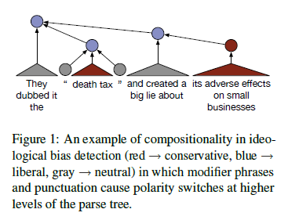
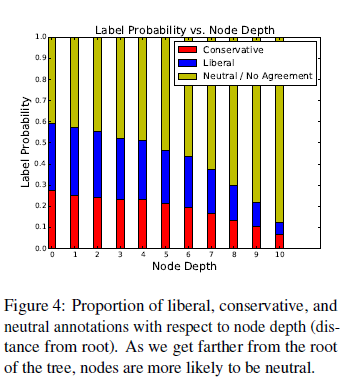
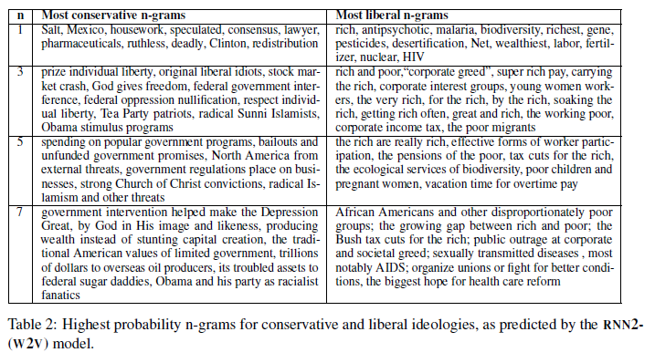

'Pop Your Filter Bubble' 프로젝트를 진행하면서 [Political Ideology Detection Using Recursive Neural Networks](https://www.aclweb.org/anthology/P14-1105/) 논문을 리뷰하게 되었다. 

> **Abstract**  
An individual’s words often reveal their political
ideology. Existing automated techniques
to identify ideology from text focus
on bags of words or wordlists, ignoring syntax.
Taking inspiration from recent work in
sentiment analysis that successfully models
the compositional aspect of language, we
apply a recursive neural network (RNN)
framework to the task of identifying the political
position evinced by a sentence. To
show the importance of modeling subsentential
elements, we crowdsource political
annotations at a phrase and sentence level.
Our model outperforms existing models on
our newly annotated dataset and an existing
dataset.  

 

## I. Introduction  
* 이 논문에서는 문장 단위의 ideological bias를 다룬다. 문서 전체가 아니라 부분적으로 ideological bias가 존재하는 경우가 많다.
* 글쓴이의 정치적 입장이 명확한 경우 , 미국 정치 관점에서 *liberal*인지, *conservative*인지 판단한다.
* ideological bias를 찾아내는 것은, 사람에게도 쉽지 않은 일이다. 정치적 지식도 있어야 하고, 글의 맥락을 읽을 수 있는 능력도 필요하다.
* **이 논문에서는 sentence 수준 뿐 아니라, phrase 수준에서도 라벨링 한 새로운 데이터 셋을 사용하였다.**

<figcaption class="caption">'death tax'(상속세), 'small business'를 단어 수준에서 보면 conservative에서 주로 쓰는 언어지만, 상위 노드로 올라가면서 "", 'big lie about'과 만나며 문장 전체는 liberal 입장이 된다.</figcaption>

 

## II. Recursive Neural Networks
### 2.1 Model Description
* RNN 인풋을 문장 순서대로 넣는 것이 아니라, 단어 레벨부터 문장 전체까지 트리 구조로 쌓아서, 말단 노드부터 최상위 노드까지 입력하는 방식  
  

<figcaption class="caption">하위 노드 left, right의 값을 넣어서 상위 노드의 값을 출력한다.</figcaption>

### 2.2 Initialization
* 초기 단어 인풋 벡터를 어떻게 설정할 것인가? 
* Random 방식과 Word2Vec 방식 중 Word2Vec(300차원) 방식을 선택
* 말단 노드는 그대로 사용하고, 상위 노드는 왼쪽 노드와 오른쪽 노드를 평균낸 값으로 초기화

 

## III. Datasets
* 초기 실험은 Convote 데이터(의회 토론 데이터, 발언자가 어느 당원인지 표기됨)를 사용하였으나, 발언자와 문장의 ideological 입장이 일치하지 않는 경우도 많아
새로운 데이터인 IBC(Ideological Books Corpus)를 만들어서 실험 진행하였다.
* IBC는 2008년부터 2012년까지 정치적 입장이 명확하기로 알려진 저자들의 글을 모아놓은 말뭉치이다. document 단위로 라벨링(right, left, center)이 되어있기 때문에 문장 단위의 라벨링이 필요했다.
* 정치적 입장이 명확한 경우 진보인지, 보수인지를 나누는 것이 목적이므로 먼저 정치적 입장이 명확한 문장인지 파악해야 한다.
    1. LIWC(Linguistic Inquiry and Word Count lexicon, Pennebaker et al., 2001)를 사용하여 Negative Emotion, Positive Emotion, Causation, Anger에 포함되는 문장, 
    그리고 Kill verb(ex: slaughter, starve, LIWC 단어 카테고리에는 포함되지 않지만, Yano et al. (2010)에 따르면 정치적 문장을 판별하는데 효과적인 단어)를 포함한 문장만 남긴다. 이걸 말뭉치 A라고 하자.  
    2. 1번의 각 카테고리에 대하여 관련이 높은 100개 biagram를 뽑는다. 이 때, 'sticky biagram'(Brown et al., 1992)을 이용한다. 'sticky biagram'은 특정 단어와 관련이 높은 bigram을 알려준다. (예를 들어, 'illegal aliens'는 conservative, 'universal healthcare'는 liberal과 sticky하게 연결되어 있다.) 다시 원래의 데이터 셋에서 카테고리 별 100개의 sticky biagram을 하나라도 포함하는 문장만 남긴다. 이를 말뭉치 B라고 하자.
    3. 말뭉치 A와 말뭉치 B의 합집합을 말뭉치 C라고 하자.
    4. 말뭉치 C에서 다시 한 번 정치적 문장을 추린다. 200개의 문장에 대해 'neutral', 'biased'로 라벨링하고 DUALIST(Settles, 2011) classifier를 학습시켜 나머지 문장을 분류한다. 
    5. 4에서 최종적으로 biased로 분류된 문장을 정치적 문장으로 본다. 
    
* 정치적 문장이 걸러졌다면, liberal인지 conservative인지 라벨링해야 한다. Crowdflower라는 크라우드 소싱 플랫폼을 사용하여 라벨링하였다. 
    * 2명 이상이 같은 대답을 한 경우에만 valid한 데이터로 사용
    * root 노드의 경우 응답자 라벨링으로 valid하게 통과된 것만 남기고, 라벨링 되지 않은 leaf 노드는 가장 가까운 root 노드의 라벨링을 따름(모든 노드가 라벨링 되도록 함)  
    
    <figcaption class="caption">문장을 노드 단위로 쪼개서 라벨링 진행</figcaption>  
    
     
    
* 라벨링 결과 하위 노드에서의 정치적 성향과 상위 레벨에서의 정치적 성향이 달라진 경우가 543건(전체 13,640건) 존재했다.
* 하위 노드의 정치적 성향은 대부분 neutral이었고, 상위 레벨로 올라갈수록 명확한 정치적 성향이 드러났다. 

 

## IV. Experiments

### 4.1 Baselines
* RANDOM: *liberal*인지 *conservative*인지 랜덤으로 선택하는 모델
* LR1: BoW 피처만 사용한 로지스틱 회귀
* LR2: BoW 피쳐와 phrase 단위 라벨을 함께 사용한 로지스틱 회귀
* LR3: BoW 피쳐와 syntactic pseudo-word 피쳐(reene&Rensnik, 2009)를 함께 사용한 로지스틱 회귀. 동사가 transiitivity인지, normalization인지를 통해 문장 구조의 dependency 반영 가능
* LR-(w2v): Word2Vec 사용한 로지스틱 회귀

### 4.2 RNN Models
* RNN1: 초기 값 랜덤으로 설정하고, 문장 단위 라벨로만 학습한 RNN
* RNN1-(w2v): 초기 값 Word2Vec으로 설정하고, 문장 단위 라벨로만 학습한 RNN
* RNN2-(w2v): 초기 값 Word2Vec으로 설정하고, 문장 단위, phrase 단위 라벨 모두로 학습한 RNN. phrase 단위의 경우, annotation 없는 경우 정확도가 낮을 수 있어, annotation 없을 때와 있을 때의 가중치를 다르게 주었다. 

* RNN2-(w2v)의 성능이 가장 높게 나옴(10번 실험 평균)  

 

## V. Where Compositionality Helps Detection Ideologial Bias 

### 5.1 Experimental Results
* RNN 계열이 BoW만 사용한 baseline 모델보다 성능이 높다.
    * RNN 계열이 상위 노드로 옮겨감에 따라 문장 전체의 정치적 성향이 바뀌는 것을 잘 포착했다는 의미 
* phrase 단위의 라벨링 사용한 것은 baseline에서는 도움 안 되었지만, RNN에서는 도움이 되었다.
    * phrase가 네트워크 구조 속에 반영 될 때 의미 있음(BoW는 구조를 반영하지 않음)
* W2V 사용은 성능을 높인다.

### 5.2 Qualitative Analysis
* 학습된 n-gram을 살펴보면, *liberal*과 *conservative*에 잘 대응하는 것으로 보인다.  

* RNN 모델은 하위노드에서 상위노드로 가면서 정치적 입장이 바뀌는 경우를 잘 포착하는 것으로 나타난다. (BoW에서 틀린 경우에도 RNN이 맞힘)  

 

## VI. Related Work
### 6.1 Automated Ideology Detection
* 주로 단어들 간의 관계를 반영하지 않는 BoW 가정 사용한 것이 많음.
* document level에서 보는 경우가 많음.

### 6.2 Subjectivity Detection
* subjectivity가 클수록 명확한 정치적 입장을 가질 가능성이 높음.
* subjectivity detection 방식 자체가 ideology detection으로 확장될 수도 있음.

 

## VII. Conclusion
* *liberal*, *conservative* 외에 *neutral* 포함 가능
* 보다 복잡한 RNN 알고리즘 사용 가능
* sentence-level과 document-level을 함께 고려

 

---  

## 느낀점
* 뉴스 기사의 논조를 파악하기 전에 주관적인 글인지 아닌지 파악하는 과정이 중요할 것 같다. 어느 입장인지 명확히 정해지지 않는 글로 학습, 추론을 한다면 결과도 별로 좋지 않을 것이다.
* 손실함수로 소프트맥스를 썼으니까, argmax를 취하기 전 확률 값으로 논조의 '정도' 또는 '스펙트럼'을 파악할 수 있지 않을까?
* sentence level과 document level을 어떻게 연결하지? 주관적인 문장을 추리고, 소프트맥스 출력을 평균?
* 노드 구조로 문장을 보았을 때 성능이 높아졌다는 점에서, 논조 파악에 그래프 임베딩이 도움이 될 수도 있다고 생각했다. 
* RNN 대신 bi-lstm 써보는 것도 좋을 것 같다. 

